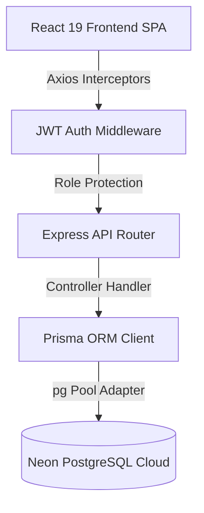

# Store Rating and Assessment System


A production-ready, full-stack application designed to facilitate store evaluations, rating aggregations, and user profile management. Built using Node.js, Express, Prisma ORM, PostgreSQL (via Neon DB), React, and Tailwind CSS, the system features a robust role-based access control (RBAC) architecture separating Administrators, Store Owners, and Users (Customers).

---

## 1. Core Features

### Administrator Dashboard & Management
* **System Analytics**: High-level system statistics tracking metrics such as total users, stores, and ratings.
* **User Management**: Unified interface to monitor, search, filter, and sort non-admin accounts (Customers and Store Owners). Administrators can register new users of any role.
* **Store Management**: Administration panel to register new stores, assign them to verified Store Owners (enforcing unique assignments), and track performance.
* **Granular User Details**: Deep-dive user profile inspector displaying user telemetry, account metrics, and associated store analytics.

### Store Owner Portal
* **Performance Telemetry**: Centralized dashboard showcasing real-time store ratings, overall average scores, and performance trends.
* **Customer Feedback Feed**: Detailed tabular view of all customer reviews containing reviewer identity (name, email), rating values (1–5), and timestamps.
* **Profile & Security**: Self-service area to view store configuration, personal information, and update authentication credentials.

### Customer (User) Portal
* **Store Discovery**: Interactive list of stores with computed average ratings and live search/filter operations by name or location.
* **Feedback Engine**: Star-rating submission system (1 to 5 stars). Database-level upsert logic prevents duplicate entries, seamlessly transitioning between submissions and updates.
* **Profile Management**: Profile review and secure password modification features.

---

## 2. Tech Stack and Architecture

The codebase utilizes a modern stack selected for high performance, type safety, and clean separation of concerns:

### Backend
* **Runtime & Framework**: Node.js & Express.js (ES Modules format).
* **Architecture Pattern**: Decoupled MVC-style design splitting routing/validation definitions (`src/routes`) from business logic execution controllers (`src/controllers`).
* **Database Interface**: Prisma ORM for type-safe database queries, declarative schema design, and migration tracking.
* **Database Engine**: PostgreSQL, hosted via Neon DB with pooled connection routing.
* **Authentication**: JSON Web Token (JWT) architecture for stateless session management.
* **Security & Encryption**: bcryptjs for multi-round secure password hashing.
* **Validation**: Express-validator middleware for robust request validation and defense against injection.

### Frontend
* **Core Library**: React 19 leveraging modern hooks, context providers, and component lifecycles.
* **Build Engine**: Vite 8 for optimized hot module replacement (HMR) and optimized build bundles.
* **Styling**: Tailwind CSS v4 for optimized utility utility styling and native CSS variable generation.
* **Theme System**: Custom light/dark mode configuration using React Context (`ThemeContext`) storing preference in local storage and matching system preference by default.
* **Routing**: React Router Dom 7 implementing layout routes, path parametrization, and secure navigation guards.
* **State & Form Management**: React Hook Form 7 for optimized, re-render-free form validations.
* **HTTP Client**: Axios with request interceptors to automatically append JWT authorization headers.

### Architecture Flow


---

## 3. Database Schema

The database schema is defined in Prisma, ensuring relational integrity and indexing safeguards:

```prisma
enum Role {
  ADMIN
  USER
  STORE_OWNER
}

model User {
  id        String   @id @default(uuid())
  name      String
  email     String   @unique
  password  String
  address   String
  role      Role
  createdAt DateTime @default(now())
  store     Store?
  ratings   Rating[]
}

model Store {
  id        String   @id @default(uuid())
  name      String
  email     String
  address   String
  ownerId   String   @unique
  owner     User     @relation(fields: [ownerId], references: [id], onDelete: Cascade)
  createdAt DateTime @default(now())
  ratings   Rating[]
}

model Rating {
  id        String   @id @default(uuid())
  userId    String
  user      User     @relation(fields: [userId], references: [id], onDelete: Cascade)
  storeId   String
  store     Store    @relation(fields: [storeId], references: [id], onDelete: Cascade)
  value     Int
  createdAt DateTime @default(now())
  updatedAt DateTime @updatedAt

  @@unique([userId, storeId])
}
```

### Key Schema Design Decisions
* **Composite Constraints**: The `@@unique([userId, storeId])` constraint on the `Rating` model ensures that a customer can only submit one rating per store, forcing updates (upserts) rather than duplicate rows.
* **Cascade Deletes**: User-to-store and store-to-ratings relations use `onDelete: Cascade` to maintain referential integrity without manual clean-up code.
* **UUID Keys**: Prevents sequential enumeration attacks on user, store, and rating primary keys.

---

## 4. Project Structure

```text
project/
├── backend/
│   ├── prisma/
│   │   ├── migrations/             # Database migration history
│   │   ├── schema.prisma           # Prisma database schema definition
│   │   └── seed.js                 # Initial admin seeding script
│   ├── src/
│   │   ├── controllers/            # Controller layer containing business logic
│   │   │   ├── adminController.js  # Admin metrics and account management logic
│   │   │   ├── authController.js   # User registration, login and settings logic
│   │   │   ├── ownerController.js  # Store owner analytics dashboard logic
│   │   │   ├── ratingsController.js# Rating submission and update logic
│   │   │   └── storesController.js # Stores query logic for consumers
│   │   ├── middleware/
│   │   │   ├── auth.js             # Authentication and authorization guards
│   │   │   └── errorHandler.js     # Centralized Express error handler
│   │   ├── routes/
│   │   │   ├── admin.js            # Admin routes definition
│   │   │   ├── auth.js             # Auth routes definition
│   │   │   ├── owner.js            # Store owner routes definition
│   │   │   ├── ratings.js          # Rating routes definition
│   │   │   └── stores.js           # Public stores routes definition
│   │   ├── utils/
│   │   │   └── prisma.js           # Prisma client initialization with pg adapter
│   │   ├── index.js                # App configuration and entry point
│   │   └── test_api.js             # Integration and API verification suite
│   ├── .env                        # Local environment variables
│   ├── package.json                # Backend dependency and script manager
│   └── prisma.config.js            # Shared Prisma settings
└── frontend/
    ├── public/                     # Static frontend assets
    ├── src/
    │   ├── components/
    │   │   ├── AdminLayout.jsx     # Responsive dashboard shell for Administrators
    │   │   ├── ProtectedRoute.jsx  # Route guard for RBAC protection
    │   │   ├── ThemeToggle.jsx     # Sun/moon toggle switch for dark/light themes
    │   │   └── UserOwnerLayout.jsx # Responsive shell for Customers and Owners
    │   ├── context/
    │   │   ├── AuthContext.jsx     # Global authentication and session state
    │   │   └── ThemeContext.jsx    # Theme toggle state provider
    │   ├── pages/
    │   │   ├── AdminDashboard.jsx  # System statistics and aggregates
    │   │   ├── AdminStores.jsx     # Store creation and owner assignment
    │   │   ├── AdminUserDetail.jsx # Administrator detailed user inspector
    │   │   ├── AdminUsers.jsx      # Multi-field filtering user management
    │   │   ├── Landing.jsx         # Sticky header-equipped public landing page
    │   │   ├── Login.jsx           # Portal access gate
    │   │   ├── OwnerDashboard.jsx  # Owner store telemetry dashboard
    │   │   ├── OwnerProfile.jsx    # Store owner profile settings
    │   │   ├── Register.jsx        # Customer registration form
    │   │   ├── UserProfile.jsx     # Customer account security page
    │   │   └── UserStores.jsx      # Customer store explore and rating interface
    │   ├── utils/
    │   │   └── axiosInstance.js    # Interceptor-equipped HTTP client
    │   ├── App.css                 # Application-wide styling overrides
    │   ├── App.jsx                 # Client-side router layout
    │   ├── index.css               # CSS entry point using Tailwind directives
    │   └── main.jsx                # React bootstrapper
    ├── index.html                  # Shell HTML template
    ├── package.json                # Frontend dependency tracker
    └── vite.config.js              # Vite compiler configuration
```

---

## 5. Security & Best Practices Implemented

* **Strict Input Validation**: Fields like name (20–60 characters), password (8–16 characters, containing uppercase and special characters), and address are strictly validated using `express-validator` on the server before database ingestion.
* **Secure Session Handling**: JWT signature verification is conducted via specialized Express middleware. Expired, altered, or missing tokens automatically trigger `401 Unauthorized` responses.
* **Role Verification Guards**: Standard routes are wrapper-protected using a curried `requireRole` middleware. Users attempting to cross boundaries receive `403 Forbidden` errors.
* **Environment Variable Isolation**: Sensitive variables like database connection strings, application ports, and JWT secret keys are isolated into environment configurations.
* **Secure Hashing**: Multi-round bcrypt hashing is used for user credentials. Unhashed passwords are never stored or logged.
* **Centralized Error Boundary**: The application deploys a centralized error middleware, logging standard stack traces internally while returning uniform, parsed JSON messages to the client (hiding raw system errors in production modes).

---

## 6. API Endpoints

### Authentication & Security
* `POST /api/auth/register` - Registers a new user with the `USER` role.
* `POST /api/auth/login` - Authenticates user credentials, returning a JWT token and user metadata.
* `PATCH /api/auth/change-password` - Updates the password for the currently authenticated user.

### Admin Dashboard and Actions (Requires `ADMIN` role)
* `GET /api/admin/dashboard` - Fetches total counts for Users, Stores, and Ratings.
* `POST /api/admin/users` - Creates a new account with any specified role (`USER`, `STORE_OWNER`, or `ADMIN`).
* `GET /api/admin/users` - Lists all users (including Administrators, Store Owners, and Customers) with query filters (name, email, address, role) and sorting.
* `GET /api/admin/users/:id` - Fetches a specific user's comprehensive details and associated store metadata.
* `POST /api/admin/stores` - Creates a store and maps it to a unique user having the `STORE_OWNER` role.
* `GET /api/admin/stores` - Retrieves all stores with their calculated average ratings and owner info.

### Customer Operations (Requires `USER` role)
* `GET /api/stores` - Lists all stores, their computed average ratings, and the current user's rating. Includes parameters for search and filtering.
* `POST /api/ratings` - Submits a rating (1-5) for a store. Executes an upsert to guarantee one rating per store per user.

### Owner Analytics (Requires `STORE_OWNER` role)
* `GET /api/owner/dashboard` - Retrieves store analytics, average rating, and a chronological listing of reviewer submissions.

---

## 7. Installation and Configuration

### Prerequisites
* Node.js (v18 or higher recommended)
* npm (v9 or higher)
* A PostgreSQL instance (local or hosted like Neon DB)

### Step 1: Clone and Set Up Backend Environment
1. Navigate to the backend directory:
   ```bash
   cd backend
   ```
2. Install the server dependencies:
   ```bash
   npm install
   ```
3. Create a `.env` file in the root of the `backend/` directory and configure the environment variables:
   ```env
   DATABASE_URL="your-postgresql-connection-string"
   PORT=8000
   JWT_SECRET="your-secure-jwt-signature-key"
   ```

### Step 2: Initialize Database and Migrations
1. Run Prisma migrations to construct the database schema:
   ```bash
   npx prisma migrate dev --name init
   ```
2. Seed the database with the default system Administrator:
   ```bash
   node prisma/seed.js
   ```
   *Note: This creates a default administrator account: `admin@admin.com` with password `Admin@123`.*

### Step 3: Set Up Frontend Environment
1. Navigate to the frontend directory:
   ```bash
   cd ../frontend
   ```
2. Install the client-side dependencies:
   ```bash
   npm install
   ```
3. Create a `.env` or `.env.local` file in the `frontend/` directory:
   ```env
   VITE_API_URL="http://localhost:8000"
   ```

---

## 8. Verification and Running Instructions

### Running the Application Locally
1. **Start the Backend API Server**:
   From the `backend/` directory, execute:
   ```bash
   npm run dev
   ```
   The API server will launch, defaulting to port `8000`.

2. **Start the Frontend Development Server**:
   From the `frontend/` directory, execute:
   ```bash
   npm run dev
   ```
   The development server will mount, exposing the UI locally (typically at `http://localhost:5173`).

3. **Log in with Seed Credentials**:
   * Open `http://localhost:5173` in your browser.
   * Access the system using the seeded credentials:
     * **Email**: `admin@admin.com`
     * **Password**: `Admin@123`
   * Use the Administrator panel to create users with the role of `STORE_OWNER` or `USER` to test the corresponding dashboards.

---

## 9. Layouts, Theme, and Responsiveness

### Theme Context System
The application implements a global theme system via React Context (`ThemeContext`). Key mechanics include:
* **Default Mode Detection**: Respects system preferences (dark/light) on initial launch.
* **State Persistence**: Theme preference is synchronized and stored in `localStorage` for session persistence.
* **Visual Toggle**: A lightweight Sun/Moon switch component (`ThemeToggle.jsx`) allows instantaneous styling shifts.
* **Engine Integration**: Integrates directly with Tailwind CSS v4's class-based dark mode engine.

### Layout Adaptability & Mobile Responsiveness
All screens and views are optimized for responsive display across mobile, tablet, and desktop viewports:
* **Admin Layout (`AdminLayout.jsx`)**: Deploys a full sidebar menu on desktop screens. On smaller screens (mobile viewports), the layout automatically shifts to a toggleable hamburger-menu drawer, conserving layout space while retaining full usability.
* **Customer and Owner Layout (`UserOwnerLayout.jsx`)**: Incorporates an accordion-style, collapsible navigation header that adapts seamlessly to screen resizing.
* **Landing Page (`Landing.jsx`)**: Styled with a sticky glassmorphic navigation header and structure-rich footer, providing an elegant and responsive entry point for authenticated and unauthenticated users alike.
* **Admin User Directory (`AdminUsers.jsx`)**: Displays administrators alongside other users, complete with a distinctive rose badge for easy identification.